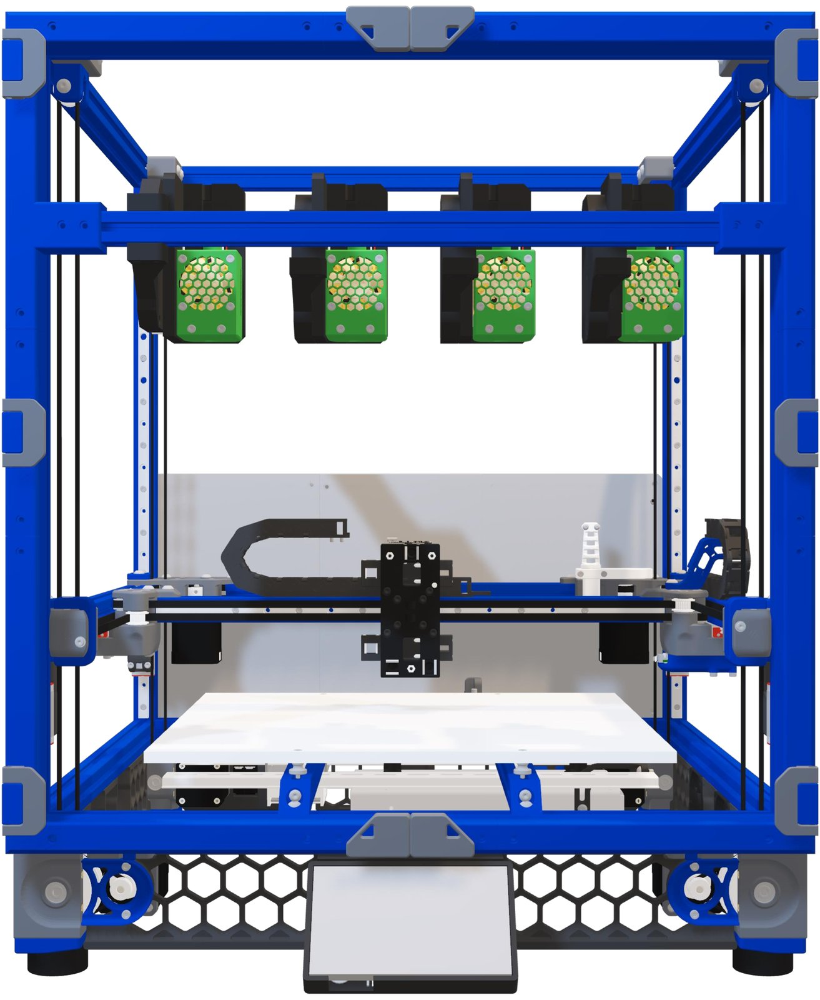
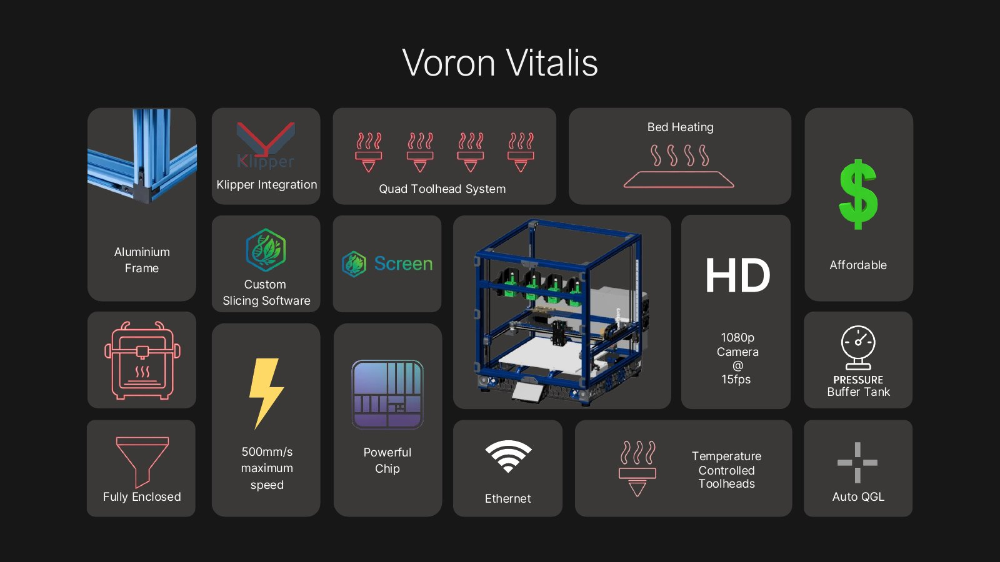
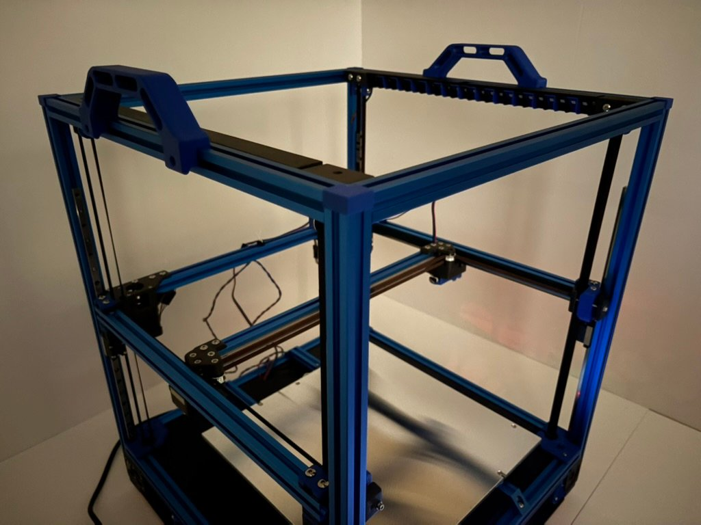
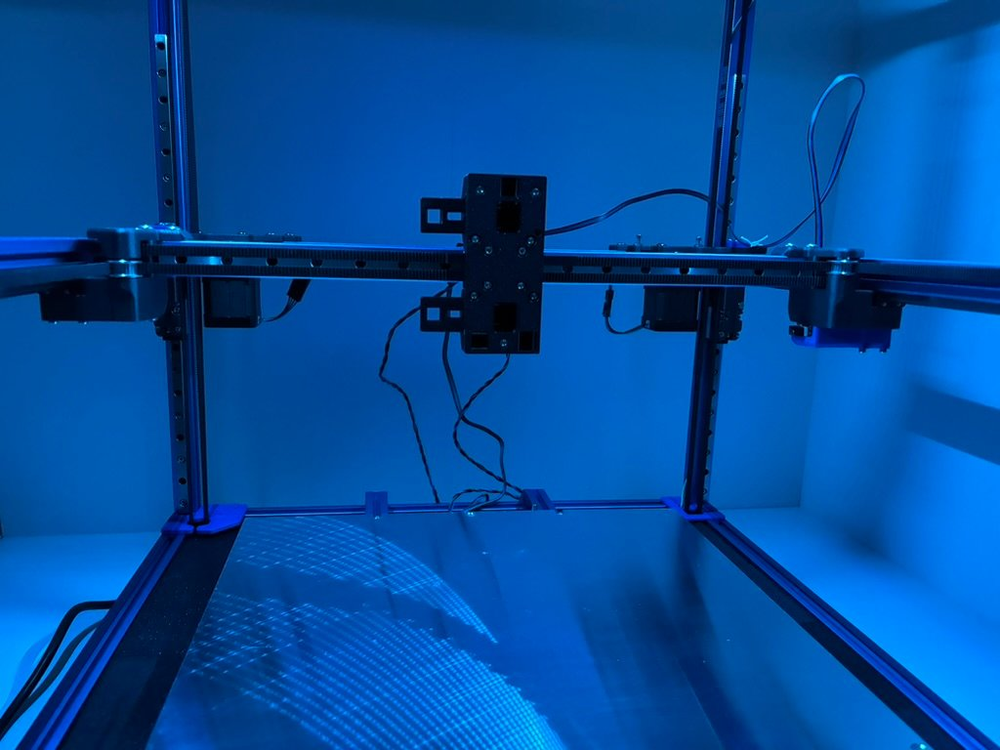
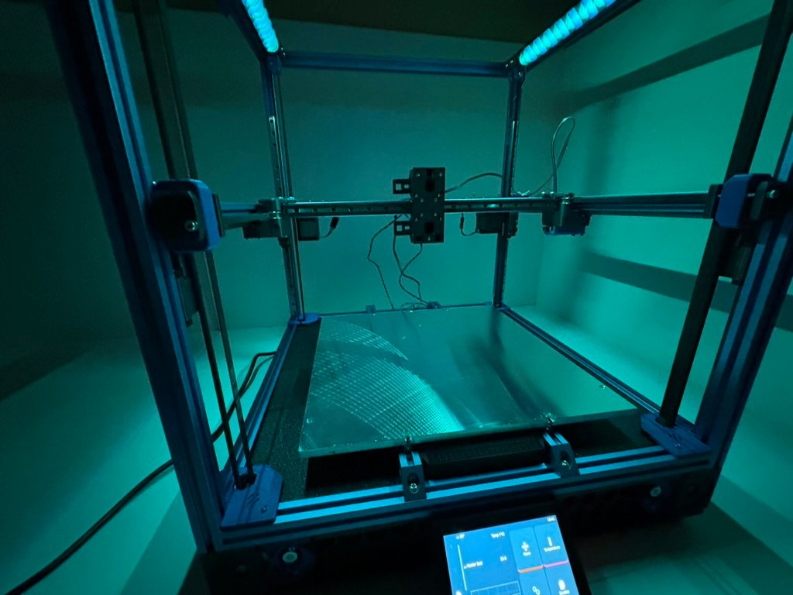
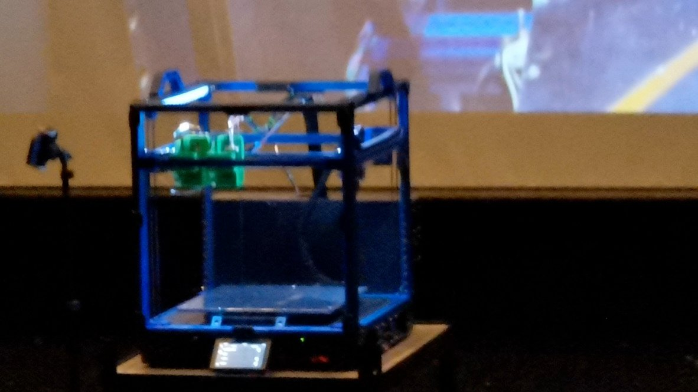

# Voron Vitalis

Voron Vitalis is an open-source extrusion bioprinter with four toolheads, built on a modified Voron 2.4 r2. Each toolhead holds its own syringe of bioink, dispensed by compressed gas (pneumatic extrusion) and kept at its own temperature, and the printer swaps between toolheads with a tool changer. Eric Chen and Emerson Yu designed and built it as their Science Academy capstone project at Fraser Heights Secondary School, from October 2024 to October 2025. The aim is a low-cost, open-source bioprinter for research and education in tissue engineering and regenerative medicine.

  

## Features

- **Four-toolhead tool changer.** Toolheads dock and swap using the [Daksh Tool Changer V2](https://github.com/ankurv2k6/daksh-toolchanger-v2) mechanism, and each toolhead can hold a different bioink.
- **Pneumatic extrusion.** Compressed gas drives bioink out of the syringe, and the system includes a pressure buffer tank. The project chose pneumatic over plunger-driven extrusion for pressure control and for compatibility with viscous bioinks.
- **Temperature control on each toolhead.** Every toolhead has its own temperature-management hardware and a fan, so it can heat or cool its bioink.
- **Camera-based tool alignment.** An open-source, camera-based alignment tool for Klipper aligns the toolheads automatically, using camera hardware from Ember Prototypes.
- **35 × 35 cm heated aluminium bed.**
- **Automatic quad gantry levelling (QGL).**
- **Klipper firmware** on an LDO Leviathan mainboard with a Raspberry Pi 5 host, plus a Raspberry Pi Pico (RP2040) secondary MCU that reads the pneumatic pressure transducer.
- **Fully enclosed** aluminium-extrusion frame.

### In development or planned

- **VitalSlicer:** a custom slicer that generates G-code for bioprinting. It is in development, and as of October 2025 was expected to be completed in 2026. It is intended to handle bioink type, extrusion rate, tool changes and curing settings.
- **UV-curing toolhead:** a tool option the tool-changer design supports, though the project documents do not confirm a finished one. The tracking sheet lists candidate LEDs from 365 to 520 nm.
- **Laser-curing module:** named as a possible future tool module.

## Hardware

- Modified Voron 2.4 r2 frame and motion system, with a 350 mm Voron 2 starter bundle linked for the frame, motors, hardware and rails. The Voron build guide is in [`Documents/`](Documents/).
- LDO Leviathan mainboard (STM32F446) running Klipper, with a Raspberry Pi 5 host and an RP2040 secondary MCU for the pressure transducer. The original plan used a BIGTREETECH Manta M8P V2.0 (see Firmware below).
- Four Daksh-style docking toolheads, each with pneumatic extrusion and temperature control.
- A 35 × 35 cm heated aluminium bed. The BOM lists a 14 × 14 in MIC6 plate and a 650 W silicone AC heater.
- A tool-alignment camera, a front touchscreen and Ethernet.

Details, sources and open questions are in [docs/hardware.md](docs/hardware.md).

## Firmware

[`Firmware/Manta M8P firmware/`](Firmware/Manta%20M8P%20firmware/) holds a Klipper configuration and a bootloader image for the BIGTREETECH Manta M8P V2.0, the controller in the project's original plan. The configuration file is BIGTREETECH's generic sample for the board. It sets up the board's pins with one extruder, a heated bed and cartesian placeholder kinematics, and it is not the configuration of the finished printer, which runs on an LDO Leviathan: it has no CoreXY, four Z motors, QGL, four toolheads, tool-changer macros or pneumatic control. See [docs/firmware.md](docs/firmware.md) for a full breakdown.

## Gallery

| | |
|---|---|
|  |  |
| Frame and motion system, August 2025 | X gantry and toolhead carriage, August 2025 |
|  |  |
| Frame interior, aluminium bed and touchscreen, August 2025 | The printer at the capstone presentation, October 2025 |

## Repository layout

| Path | Contents |
|---|---|
| `Capstone Documents/Group/` | Early project brainstorm (timed write, October 2024) |
| `Documents/` | Voron 2.4 r2 assembly manual (Voron Design) |
| `Firmware/Manta M8P firmware/` | Klipper sample configuration and bootloader for the Manta M8P V2.0 |
| `References/Replistruder V3/Tools/` | Replistruder 3 syringe extruder body, plunger holder and syringe holders (STEP/STL) |
| `References/Replistruder V3/Calibration setup/` | Camera PCB and Raspberry Pi mounts and lids (STEP) |
| `References/Replistruder V3/Modified Gregory Holloway's toolchanger enclosure/` | Enclosure panels and printed parts, including a HEPA-filter and fan mount (STEP/STL) |
| `References/Replistruder V4/` | Replistruder 4 syringe extruder STEP files |
| `docs/` | Hardware and firmware notes and the images used in this README |

`References/` holds third-party and reference designs. The project documents do not say which of them are used on the printer.

## Project status

This repository holds reference CAD, the Voron build guide and the original controller's sample configuration. The following are not yet published here:

- the printer's working Klipper configuration, including tool-changer macros and tool offsets
- the pneumatic system's parts list and settings
- wiring diagrams
- build and calibration instructions

The full CAD model is linked below.

## Links

**Project files**

- [Project Google Drive folder](https://drive.google.com/drive/folders/16qfKwxlemoa1IxDVArS9bfp_ugmO_NL0?usp=drive_link): capstone presentation, photos and CAD
- [Voron Vitalis CAD](https://drive.google.com/file/d/1OEAgosiyo6S9CeYaMxNo6Nz90X1KycL4/view?usp=sharing): Fusion 360 archive (`.f3z`), about 390 MB
- [Capstone presentation (PDF)](https://drive.google.com/file/d/1Rc4oeaZDOKPLHv32bqnYH4pi2rhnJo1t/view)
- [Parts and cost tracking sheet](https://docs.google.com/spreadsheets/d/188soFzGzhO4Uy-CefZMIBgignTyijYFp2OP5K6e-ZxM/edit?usp=sharing)

**References**

- [Daksh Tool Changer V2](https://github.com/ankurv2k6/daksh-toolchanger-v2)
- Engberg A., Stelzl C., Eriksson O., O'Callaghan P., Kreuger J. [An open source extrusion bioprinter based on the E3D motion system and tool changer to enable FRESH and multimaterial bioprinting](https://www.nature.com/articles/s41598-021-00931-1). *Scientific Reports* 11, 21547 (2021).
- Tashman J. W., Shiwarski D. J., Feinberg A. W. [A high performance open-source syringe extruder optimized for extrusion and retraction during FRESH 3D bioprinting](https://doi.org/10.1016/j.ohx.2020.e00170). *HardwareX* 9, e00170 (2021).
- [Voron 2.4 frame, motors, hardware and linear rails (350 mm starter bundle)](https://www.3dlabtech.ca/product/voron-2-starter-bundle-350mm/)
- [BIGTREETECH Manta M8P](https://github.com/bigtreetech/Manta-M8P)

## Third-party designs

The project builds on these designs, and the repository includes files from some of them. Each remains under its original authors' terms:

- **Voron 2.4 r2** and its assembly manual: Voron Design.
- **Replistruder 3 and Replistruder 4** syringe extruders: Feinberg Lab, Carnegie Mellon University. The Replistruder 4 files are released under CC BY-SA 4.0 (Tashman et al., 2021).
- **Toolchanger enclosure:** a modified version of Gregory Holloway's design.
- **Tool changer mechanism:** Daksh Tool Changer V2.
- **Manta M8P sample configuration:** BIGTREETECH.

## Team

- Eric Chen
- Emerson Yu

## Supporters

- **Proudly supported by** [LDO Motion](https://ldomotion.com/p/home) and [Ember Prototypes](https://www.emberprototypes.com)
- 
- 

